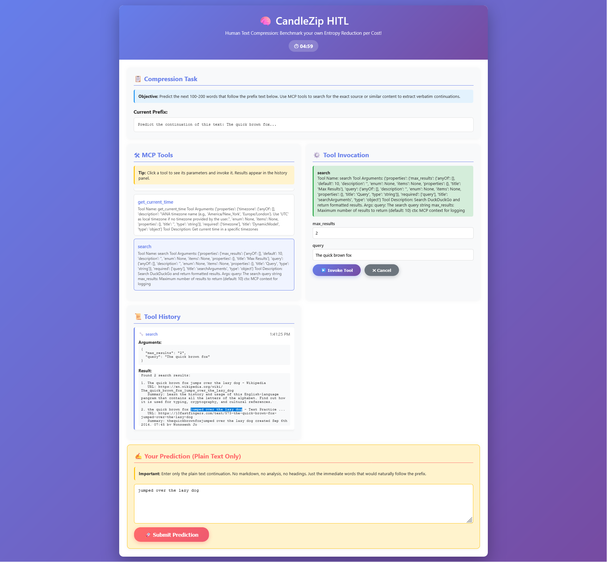

# CandleZip: Agentic Compressor

CandleZip is an agent-in-the-loop compressor that measures the practical value of tool-usage for prediction and lossless compression. It combines language models with controlled external channels (``tools'') and reports a reproducible, integer-bit audit signal describing how much side-information reduced coding length under a priced budget.

DOI: [10.5281/zenodo.17282860](https://doi.org/10.5281/zenodo.17282860)

## Overview

CandleZip implements a sink-inclusive minimum description length workflow (SIMDL). The system treats tools as priced observation channels (entropy sinks) and measures the agent's effectiveness by how many bits the agent saves per unit cost. Key concepts are:

- Entropy reduction: the decrease in coding length (bits) achieved by conditioning on accepted tool outputs.
- Decode-safe accounting: all information required to deterministically decode must either be shipped in the bitstream or regenerable at decode time; shipped items are priced and accounted explicitly.
- Capacity–efficiency decomposition: capacity is the channel-side mutual-information ceiling (ideal limit under optimal coding); efficiency is the agent's realized fraction of that ceiling under a given budget and coder.

## Key features

- Deterministic, replayable encoding and decoding with cached agent outputs for exact verification.
- Gross vs. net accounting: gross bitstream reductions are reported alongside shipped costs so users can evaluate net savings.
- Gate-based hint acceptance: the system accepts side-information only when the expected bit savings exceed the priced cost (including shipped bits and any exogenous costs).
- Structured logging and per-chunk CSV output for offline analysis and reproducible audits.
- Tools for Pareto analysis and statistical validation (bootstrap confidence intervals, paired tests).

## Quick start

```bash
# Build the compressor (Windows PowerShell)
./build.ps1

# Run a deterministic self-test with agent-in-the-loop
./target/release/candlezip.exe  --backend smollm --agent --scan \
  --scan-lookahead 512 --context 512 --reprime-interval 512 \
  --scan-agent-script agent/agent_v2.py --scan_max_steps 12 \
  self-test benchmarks/your_file.txt

```

## Human-in-the-Loop (HITL) Usage

You can run CandleZip with a human-in-the-loop agent to have a person provide predictions (instead of an LLM). This is useful for benchmarking human vs. model entropy reduction per cost. The repository includes a drop-in HITL agent (`agent/agent_human.py`) that launches a web UI and returns the human's plaintext continuation to CandleZip.

Example:

```bash
# Self-test with human in the loop
./target/release/candlezip.exe --backend smollm --agent --scan \
  --scan-lookahead 512 --context 512 --reprime-interval 512 \
  --scan-agent-script agent/agent_human.py --scan_max_steps 12 \
  self-test benchmarks/your_file.txt
```

We also provide a screenshot of the HITL UI (`./imgs/hitl_image.png`) to demonstrate how MCP tools are made human-accessible inside the interface.



## DOI:
[10.5281/zenodo.17282860](https://doi.org/10.5281/zenodo.17282860)

## Research and reproducibility

CandleZip produces deterministic bitstreams and per-chunk proofs that enable exact roundtrip verification. Outputs include:

- Encoded files with gate records (compact per-chunk gate metadata) and optional shipped hint descriptions
- `proof.csv` files with per-chunk baseline/conditioned bits, bits-saved, gate decisions, and pricing columns
- Watchdog logs and cached agent outputs for deterministic replay

These artifacts make it possible to reproduce measured compression gains, audit gating decisions, and evaluate agents under controlled budgets.

## License and contact

This README and related documentation are licensed under Creative Commons Attribution 4.0 International (CC BY 4.0).

CandleZip source code is licensed under GNU General Public License v3.0 (GPL-3.0).

See the repository root for licensing and contribution information. For questions, open an issue or contact the maintainer listed in the repository.
