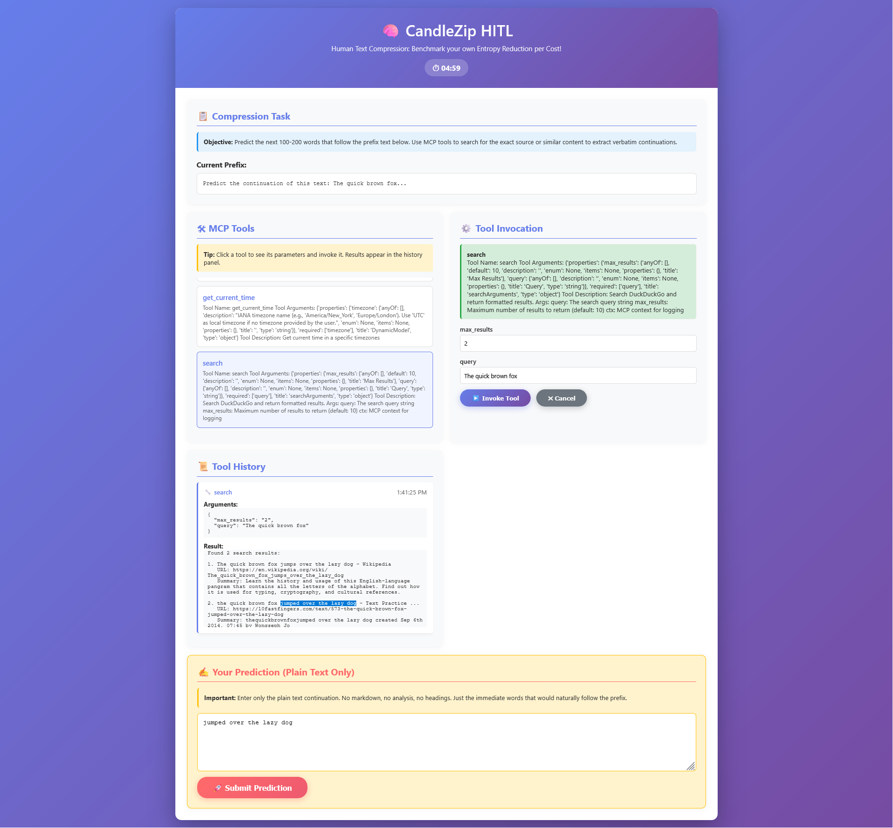

# CandleZip Human-in-the-Loop (HITL) Agent

## Overview

The HITL agent provides a research-grade web interface that allows humans to perform compression prediction tasks with full access to MCP tools. This enables empirical comparison between human and LLM performance in the Agentic Compression framework, as theorized in the paper.
This leaves minimal ambiguity between human-AI evaluations as the toolset is identical, through MCP.

In practice, you can evaluate tool ROI **manually** with this strategy.

## Features

- **Modern Web Interface**: Beautiful, responsive UI with gradient design
- **Full MCP Tool Integration**: Access all MCP tools configured in `mcp_config.json`
- **Real-time Tool Invocation**: Invoke tools and see results immediately
- **Tool History Tracking**: Complete audit trail of all tool uses
- **Seamless Integration**: Drop-in replacement for `agent_v2.py` - no Rust changes needed
- **Research-Grade Output**: Maintains exact API compatibility with LLM agent

## Installation

### Prerequisites

```bash
# Install Flask for the web server
pip install flask

# Ensure you have the CrewAI dependencies already installed
# (these should be installed if you're using agent_v2.py)
pip install crewai crewai-tools python-dotenv
```

### Verify Installation

```bash
python agent/agent_human.py --help
```

## Usage

### Basic Usage with CandleZip

The HITL agent is a drop-in replacement for the LLM agent. Simply use `--scan-agent-script` to specify it:

```bash
# Self-test with HITL agent
candlezip self-test --backend smollm --agent --scan \
  --scan-lookahead 512 --context 512 --reprime-interval 512 \
  --scan-agent-script agent/agent_human.py \
  --scan_max_steps 12 \
  benchmarks/alice29.txt

# Compress with HITL agent
candlezip compress --backend smollm --agent --scan \
  --scan-lookahead 512 --context 512 --reprime-interval 512 \
  --scan-agent-script agent/agent_human.py \
  --scan_max_steps 12 \
  input.txt output.canz
```

### Standalone Testing

You can also test the HITL agent standalone:

```bash
python agent/agent_human.py --task "Predict the continuation of this text: The quick brown fox..." --mcp-config agent/mcp_config.json
```

### Command-Line Options

```bash
python agent/agent_human.py [OPTIONS]

Required (one of):
  --task TEXT               Task description directly
  --task-file PATH          Path to file containing task

Optional:
  --mcp-config PATH         Path to MCP config (default: mcp_config.json)
  --max-steps INT           Max steps (kept for compatibility, default: 15)
  --port INT                Web server port (default: 5000)
  --no-browser              Don't auto-open browser
```

## How It Works

### Workflow

1. **Invocation**: Rust calls `agent_human.py` with task description
2. **UI Launch**: Web server starts and browser opens automatically
3. **Human Analysis**: User views prefix text and prior memory
4. **Tool Usage**: User invokes MCP tools to find information
5. **Prediction**: User enters plain text continuation
6. **Submission**: Result is returned to Rust in JSON format

### API Compatibility

The HITL agent maintains exact compatibility with `agent_v2.py`:

**Input (from Rust):**
- Command-line arguments: `--task`, `--mcp-config`, `--max-steps`
- Environment variables: `CANDLEZIP_INPUT_FILE`, `CANDLEZIP_CHUNK_INDEX`

**Output (to Rust):**
```
AGENT_RESULT_JSON:{"final_text": "...", "duration_ms": 12345}
```

### MCP Tools Integration

The HITL agent loads and exposes all MCP tools from your configuration:

1. **Tool Discovery**: Reads `mcp_config.json` to find available servers
2. **Tool Loading**: Initializes MCP adapters and extracts tool metadata
3. **Dynamic Forms**: Generates input forms based on tool schemas
4. **Invocation**: Calls tools with user-provided arguments
5. **Results Display**: Shows tool outputs in scrollable history

## UI Components

### Main Interface

The interface is divided into responsive panels. The UI title and header emphasize human-driven compression as a benchmarkable task:

- **Title**: "Human Text Compression: Benchmark your own Entropy Reduction per Cost!"

We make MCP tools human-accessible inside the UI so humans can invoke the same set of tools available to LLM agents. See the screenshot below for an example of the HITL interface.



1. **Header**: Timer showing elapsed time
2. **Task Panel**: Displays current prefix and prior memory
3. **Tools Panel**: List of available MCP tools (clickable)
4. **Invocation Panel**: Dynamic form for selected tool
5. **History Panel**: Scrollable log of all tool invocations
6. **Prediction Panel**: Text area for final answer submission

### Tool Invocation

1. Click any tool in the tools panel
2. Tool details and input form appear in invocation panel
3. Fill in parameters (auto-detected from schema)
4. Click "Invoke Tool" button
5. Results appear in history panel
6. Repeat as needed for research

### Submission

1. Enter plain text continuation in prediction text area
2. Click "Submit Prediction" button
3. Confirm submission
4. UI closes and result is returned to CandleZip

## Research Applications

### Empirical HITL Studies

The HITL agent enables:

- **Human vs LLM Comparison**: Run identical tasks with both agents
- **Tool Usage Analysis**: Track which tools humans use vs LLM
- **Time-Controlled Studies**: Built-in timer for budget comparisons
- **Audit Trail**: Complete tool history for reproducibility

### Experimental Design

**Matched Budget Protocol:**

```bash
# LLM agent with 360s timeout
candlezip compress --backend smollm --agent --scan \
  --scan-agent-timeout 360 \
  --scan-agent-script agent/agent_v2.py \
  input.txt llm.canz

# Human agent with same corpus and tools
candlezip compress --backend smollm --agent --scan \
  --scan-agent-timeout 360 \
  --scan-agent-script agent/agent_human.py \
  input.txt human.canz
```

**Analysis:**

1. Compare `proof.csv` files from both runs
2. Examine `bits_saved` per chunk
3. Analyze tool usage patterns from logs
4. Calculate efficiency metrics (bits per second)

### Data Collection

The HITL agent generates:

- `proof.csv`: Per-chunk compression metrics (same as LLM agent)
- `agent_chunk_*.log`: Complete interaction logs
- `meta.json`: Run metadata with timing information
- MCP tool invocation history in logs

## Advanced Features

### Custom Port

If port 5000 is in use:

```bash
python agent/agent_human.py --task "..." --port 8080
```

### Headless Mode

For server environments:

```bash
python agent/agent_human.py --task "..." --no-browser
# Then access http://localhost:5000 manually
```

### Multiple Simultaneous Sessions

Each CandleZip run spawns its own HITL instance on a random available port, allowing parallel human studies.

## Troubleshooting

### Port Already in Use

```bash
# Use custom port
python agent/agent_human.py --task "..." --port 5001
```

### MCP Tools Not Loading

1. Check `mcp_config.json` exists and is valid JSON
2. Verify MCP server (e.g., Docker) is running
3. Check agent logs for MCP initialization errors

### Browser Doesn't Open

```bash
# Use --no-browser and open manually
python agent/agent_human.py --task "..." --no-browser
# Navigate to http://localhost:5000
```

### Results Not Returned to CandleZip

- Ensure you click "Submit Prediction" button
- Check that prediction text area is not empty
- Verify Flask server shuts down after submission

## Technical Details

### Dependencies

- **Flask**: Web server framework
- **CrewAI Tools**: MCP adapter integration
- **Python 3.11+**: Required for compatibility

### Architecture

```
┌─────────────┐
│ CandleZip   │
│ (Rust)      │
└──────┬──────┘
       │ spawns
       ▼
┌─────────────┐
│ agent_human │
│ .py         │
└──────┬──────┘
       │ starts
       ▼
┌─────────────┐     ┌──────────┐
│ Flask       │────▶│ Browser  │
│ Web Server  │     │ UI       │
└──────┬──────┘     └────┬─────┘
       │                 │
       │ MCP Tools       │ User
       ▼                 ▼
┌─────────────┐     ┌──────────┐
│ MCP         │     │ Human    │
│ Servers     │     │ Input    │
└─────────────┘     └──────────┘
```

### File Structure

```
agent/
├── agent_human.py          # Main HITL script
├── agent_v2.py             # LLM agent (for comparison)
├── mcp_config.json         # MCP tool configuration
├── README_HITL.md          # This file
└── .env                    # API keys (create if needed)
```

## Scientific Validity

### Controlled Variables

The HITL agent ensures:

1. **Same task presentation**: Identical prefix text as LLM sees
2. **Same tool access**: Identical MCP tool set
3. **Same output format**: Plain text continuation only
4. **Same integration**: No special treatment in compression pipeline

### Measurement Invariants

- **Compression metric**: Same arithmetic coding across both agents
- **Gating criterion**: Same threshold for accepting predictions
- **Budget accounting**: Time and hint-byte limits applied equally

### Reproducibility

All HITL sessions are:

- **Logged**: Complete tool history and timing
- **Auditable**: CSV output matches LLM agent format
- **Versioned**: Git-tracked code ensures consistency

## Citation

If you use the HITL agent in your research, please cite the Agentic Compression paper:

```bibtex
@article{cashin2025agentic,
  title={Agentic Compression: Intelligence as Entropy Routing},
  author={Cashin, Noah},
  year={2025},
  note={DOI: 10.5281/zenodo.17282860}
}
```

## License

Same as CandleZip: GNU General Public License v3.0 (GPL-3.0)

## Support

For issues or questions:

1. Check this README
2. Review `agent_v2.py` for LLM agent comparison
3. Examine Rust logs in `scan_output/` directories
4. File issues on GitHub with full logs

---

**Research-grade human text compression interface.**
**Damn good looking, too.** 🧠✨

**Note:** Use `--scan-agent-script agent/agent_human.py` to run CandleZip with the HITL agent; the toolset exposed in the UI comes from your `mcp_config.json`.

